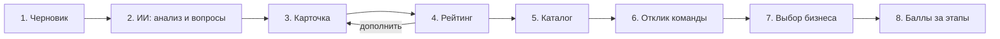
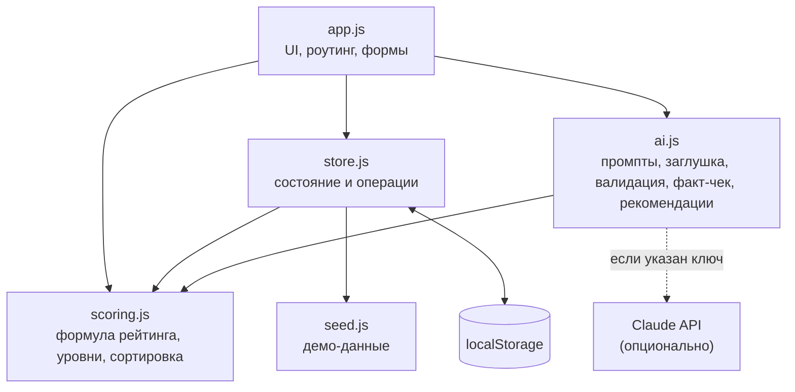

# hack-e3809f66-jasai
Hackathon team repository for JASAI
# AI Sana · Рейтинг качества бизнес-задач

> Бизнес описывает задачу, ИИ помогает её дополнить, рейтинг показывает её готовность, а студенты сами выбирают, за что взяться.

Репозиторий: https://github.com/BAITC-Hacks/hack-e3809f66-jasai
# AI Sana · Рейтинг качества бизнес-задач

> Бизнес описывает задачу, ИИ помогает её дополнить, рейтинг показывает её готовность, а студенты сами выбирают, за что взяться.

Репозиторий: https://github.com/BAITC-Hacks/hack-e3809f66-jasai

---

## 1. Название проекта

**AI Sana · Рейтинг задач**: MVP платформы для геймификации практических заданий между бизнесом и студенческими командами.

## 2. Краткое описание

**Проблема.** Компании часто приносят студентам задачи вроде «Нужен бот для кофейни». В таком описании нет данных, критериев успеха, сроков и контакта. Студенты тратят время на выяснение деталей или берутся за задачу, которую невозможно довести до результата. Задача описана неполно, и никакой обратной связи о качестве описания бизнес не получает.

**Решение.** Платформа превращает черновое описание в полноценную карточку задачи и оценивает её **рейтингом готовности от 0 до 100**. Чем полнее и полезнее описание, тем выше рейтинг и позиция в общем каталоге. Основная геймификация направлена на **бизнес**: рейтинг мотивирует дописывать недостающие сведения и прямо показывает, сколько баллов даст каждое дополнение.

**Для кого:**
- **Представители бизнеса** быстро оформляют задачу и видят, как сделать её привлекательнее для студентов.
- **Студенческие команды** видят открытый каталог, где сразу понятно, насколько реально начать работу без дополнительных уточнений.

Система **не назначает** команды: студенты выбирают задачи сами, а бизнес сам решает, с кем работать.

## 3. Что реализовано

| Модуль | Возможности |
|---|---|
| **Конструктор задачи** | Свободный ввод черновика; ИИ-анализ полноты; 3–5 уточняющих вопросов по самым весомым пробелам; автосборка редактируемой карточки; ручное подтверждение; повторные уточняющие вопросы для уже созданной карточки |
| **Карточка задачи** | 10 полей: название, контекст, потребность, пользователи, данные, ограничения, ожидаемый результат, критерии успеха, контакт, формат взаимодействия |
| **Рейтинг задачи** | Оценка 0–100 по прозрачной формуле; расшифровка баллов по каждому показателю; список «Что повысит рейтинг» с приростом и подсказкой для каждого поля; пересчёт в реальном времени при редактировании и фиксация после подтверждения; история роста рейтинга (например, `25 → 80 → 97`) |
| **Уровни готовности** | Черновик (0–39), Рабочая (40–69), Готовая (70–89), Приоритетная (90–100), каждый со своим оформлением в каталоге |
| **Общий каталог** | Все опубликованные задачи доступны всем командам; сортировка по рейтингу; номер позиции; фильтры по теме, уровню и тексту; пометка «Требует уточнения» у черновиков |
| **Рекомендации** | Подбор задач под интересы, навыки и технологии команды (только задачи с рейтингом от 40). Это подсказка: каталог не ограничивается |
| **Отклики команд** | Идея решения, план, срок, ссылка на прототип; валидация формы; число откликов не ограничено |
| **Выбор бизнеса** | Список предложений с навыками команд; ручные действия «Выбрать», «Отклонить», «Вернуть на рассмотрение»; можно выбрать одну, несколько или ни одной команды |
| **Баллы команд за прогресс** | Бизнес подтверждает этапы работы выбранной команды: прототип +20, промежуточный результат +30, финальная сдача +50; рейтинг команд |
| **Прозрачность ИИ** | Раздел «ИИ»: промпты, формат входа и выхода (JSON Schema), журнал всех вызовов, демонстрация обработки некорректного ответа модели |
| **Тесты** | 20 автоматических проверок формулы, уровней, ИИ-заглушки и валидатора |

## 4. Как работает решение

Сквозной сценарий от черновика до результата:



1. **Черновик.** Представитель бизнеса пишет пару предложений о своей потребности и выбирает отрасль.
2. **Уточнение.** ИИ разносит сведения из текста по полям карточки, находит пробелы и задаёт уточняющие вопросы. Рядом показано, что уже понятно, и текущий рейтинг черновика.
3. **Карточка.** Ответы попадают в соответствующие поля. Бизнес редактирует текст и подтверждает карточку.
4. **Рейтинг.** Система начисляет баллы за заполненные поля, показывает расшифровку и подсказки. После каждого подтверждённого дополнения рейтинг пересчитывается.
5. **Каталог.** Опубликованная задача встаёт на позицию, соответствующую рейтингу.
6. **Выбор студентов.** Команда просматривает каталог и рекомендации и отправляет предложение.
7. **Выбор бизнеса.** Бизнес сравнивает отклики и вручную выбирает или отклоняет их.
8. **Результат.** После подтверждения этапа работы выбранная команда получает баллы.

### Формула рейтинга

| Показатель | Вес | Поля карточки |
|---|---|---|
| Контекст и потребность | 20 | контекст 10 + потребность 10 |
| Данные и материалы | 20 | данные |
| Ожидаемый результат | 15 | ожидаемый результат |
| Критерии успеха | 15 | критерии успеха |
| Ограничения | 10 | ограничения |
| Пользователи | 10 | пользователи |
| Связь с бизнесом | 10 | контакт 5 + формат взаимодействия 5 |

Каждое поле получает долю своего веса: **0**, если оно пустое; **0.3**, если слишком краткое (меньше 20 символов); **0.7**, если заполнено частично; **1.0**, если выполнен признак полноты. Признаки полноты для каждого поля:

- **Контекст**: не менее 80 символов.
- **Потребность**: есть глагол изменения («нужно», «сократить», «автоматизировать»…).
- **Пользователи**: названа роль или количество.
- **Данные**: указан источник и объём, период или формат (CSV, Excel, API, выгрузка).
- **Ожидаемый результат**: назван конкретный артефакт (прототип, бот, дашборд, модель…).
- **Критерии успеха**: есть измеримый показатель (цифра или процент).
- **Ограничения**: указаны сроки, технологии, доступы, NDA или бюджет.
- **Контакт**: email, телефон или Telegram.
- **Формат взаимодействия**: указаны регулярность или канал.

Баллы засчитываются только за **подтверждённую** карточку. Во время редактирования видна предварительная оценка вида «Подтверждено: 80 → после подтверждения: 97 (+17)».

### Правила каталога

- Сортировка по рейтингу по убыванию. При равном рейтинге выше задача, опубликованная позже.
- Низкий рейтинг **не скрывает** задачу и **не запрещает** отклик. Задачи уровня «Черновик» помечены «Требует уточнения».
- Задачи уровня «Приоритетная» выделены цветом и фоном.
- Рекомендовать задачи система может только при рейтинге от 40.
- Команду выбирает только бизнес; автоматического назначения нет.

## 5. Технологии

| Категория | Что используется |
|---|---|
| Языки | JavaScript (ES2020), HTML5, CSS3 |
| Фреймворки и библиотеки | Не используются: чистый JavaScript без сборки и зависимостей |
| Хранение данных | `localStorage` браузера |
| AI-модель (опционально) | Claude (Anthropic), по умолчанию `claude-opus-5`; модель меняется в настройках |
| API | Anthropic Messages API (`POST https://api.anthropic.com/v1/messages`) со structured outputs (JSON Schema) |
| AI без сети | Локальная заглушка на правилах (ключевые слова и эвристики на JS) |
| Тестирование | Собственный набор тестов в браузере (`tests.html`) |

## 6. Архитектура проекта

Одностраничное приложение (SPA) без сервера. Модули подключаются обычными `<script>` и общаются через глобальные объекты.



| Файл | Назначение |
|---|---|
| `index.html` | Точка входа, подключает стили и скрипты |
| `css/style.css` | Оформление интерфейса |
| `js/seed.js` | Синтетические данные: черновики, карточки, команды, отклики, этапы |
| `js/scoring.js` | Описание полей и весов, оценка каждого поля, итоговый рейтинг, уровни, сортировка каталога. Чистые функции |
| `js/ai.js` | Промпты и JSON-схемы, локальная заглушка, вызов Claude API, валидация ответа, проверка «нет выдуманных фактов», рекомендации задач командам |
| `js/store.js` | Состояние приложения и операции: подтвердить карточку, опубликовать, отправить отклик, выбрать или отклонить, подтвердить этап |
| `js/app.js` | Экраны: главная, конструктор, каталог, задача, мои задачи, мои отклики, команды, ИИ |
| `tests.html`, `js/tests.js` | Автотесты |

**Как защищён AI-модуль.** Если включён Claude API, каждый ответ проходит три проверки:

1. **JSON.** Ответ должен разбираться как JSON.
2. **Схема.** Все поля присутствуют и являются строками, поле вопроса входит в список допустимых, текст вопроса не пустой.
3. **Факт-чек.** Если в поле есть число, которого не было во входных данных, или больше половины слов не встречается во входе, поле заменяется текстом из исходных данных.

При ошибке парсинга или схемы, отказе модели, обрезанном ответе или сетевой ошибке используется результат локальной заглушки. Причина пишется в журнал и показывается пользователю. Если модель вернула меньше 3 вопросов, недостающие добираются локально.

## 7. Установка и запуск

Нужен только современный браузер (Chrome, Edge, Firefox, Safari). Node.js, Python и установка пакетов не требуются.

**Вариант 1: открыть файл.**

```bash
git clone https://github.com/BAITC-Hacks/hack-e3809f66-jasai.git
cd hack-e3809f66-jasai
```

Затем откройте `index.html` в браузере двойным кликом или командой:

```bash
# Windows
start index.html
# macOS
open index.html
# Linux
xdg-open index.html
```

**Вариант 2: через локальный веб-сервер** (если есть Python или Node.js):

```bash
python -m http.server 8000
# или
npx serve .
```

После этого откройте http://localhost:8000.

**Тесты:** откройте `tests.html`. Ожидаемый результат: `PASSED: 20 из 20`.

**Подключение Claude API (необязательно):**
1. Откройте раздел **ИИ** в шапке.
2. Выберите режим «Claude API», вставьте API-ключ Anthropic и нажмите «Сохранить».
3. Без ключа всё работает на локальной заглушке.

**Сброс данных:** раздел **ИИ** → «Сбросить демо-данные» (кнопку нужно нажать дважды).

## 8. Как проверить решение

Сценарий занимает около 5 минут и проходит все ключевые переходы.

**Шаг 1. Слабое описание** (роль «Я — бизнес», компания Bean&Go)
1. Нажмите **«Создать задачу»**.
2. Выберите пример черновика **«Bean&Go»**: «Хотим чат-бота для кофейни, чтобы принимать заказы.»
3. Нажмите **«Проанализировать черновик»**.
4. ✅ Рейтинг черновика **25** (уровень «Черновик»), ИИ задаёт **5 уточняющих вопросов**.

**Шаг 2. Дополнение и рост рейтинга**
1. Ответьте на вопросы, например:
   - Данные: `Меню в Excel, 40 позиций, история заказов из кассы за 3 месяца`
   - Критерии успеха: `30% заказов через бота за первый месяц`
   - Пользователи: `Гости кофейни и 4 бариста`
   - Контекст: `Сейчас заказы принимают только на кассе, в час пик очередь до 15 минут`
   - Результат: `Telegram-бот с меню, корзиной и оплатой, который передаёт заказ бариста`
2. Нажмите **«Сформировать карточку»**. ✅ Рейтинг около **80** («Готовая»).
3. Нажмите **«Подтвердить карточку»**.
4. Допишите поля:
   - Ограничения: `Срок 4 недели, Python`
   - Контакт: `aruzhan@beango.kz`
   - Формат взаимодействия: `Созвон раз в неделю`
5. ✅ Панель показывает «80 → 97 (+17)», пункты в «Что повысит рейтинг» исчезают.
6. Нажмите **«Подтвердить изменения»**, затем **«Опубликовать в каталог»**.

**Шаг 3. Каталог**
1. ✅ Задача получает позицию **#2**, история рейтинга `25 → 80 → 97`.
2. В **«Каталоге»** задача стоит среди приоритетных. Задача с рейтингом 24 внизу, она видна и помечена «Требует уточнения».

**Шаг 4. Отклик команды**
1. Переключите роль на **«Я — студенческая команда»** и выберите **Steppe Devs**.
2. В каталоге появился блок рекомендаций. Откройте созданную задачу.
3. Нажмите «Отправить предложение» с пустой формой. ✅ Появляются ошибки валидации.
4. Заполните идею, план, срок, ссылку (`https://github.com/steppe/bot`) и отправьте.

**Шаг 5. Решение бизнеса и баллы команды**
1. Вернитесь на роль **«Я — бизнес»** с компанией **Bean&Go** и откройте задачу.
2. Нажмите **«Выбрать»** у отклика (или **«Отклонить»**).
3. Выберите этап «Прототип» и нажмите **«Подтвердить этап»**.
4. ✅ В разделе **«Команды»** у Steppe Devs появляется **+20 баллов**.

**Шаг 6. Прозрачность ИИ**
1. Откройте раздел **«ИИ»**: там промпты, формат входа и выхода, журнал вызовов.
2. Нажмите **«Выдуманные факты»**. ✅ Валидатор удаляет цифры, которых не было в черновике, и дополняет вопросы до трёх.
3. Нажмите **«Не JSON»** и **«Нарушена схема»**. ✅ Ответ отклоняется, используется локальный результат.

## 9. Данные и интеграции

**Источники данных.** Организаторы данных не выдавали, поэтому используются синтетические данные из `js/seed.js`. Они загружаются при первом запуске:

| Набор | Объём | Содержимое |
|---|---|---|
| Черновики задач | 5 | Текст, компания, отрасль; полнота от одной фразы до почти готового описания |
| Карточки задач | 5 | Все поля рейтинга; баллы рассчитываются формулой (100, 93, 86, 59, 24), покрыты все 4 уровня |
| Профили команд | 5 | Название, интересы, навыки, технологии |
| Предложения | 5 | Команда, идея, план, срок, ссылка, статус (на рассмотрении, выбрана, отклонена) |

Все данные, которые создаёт пользователь (задачи, отклики, решения, этапы, журнал ИИ), сохраняются в `localStorage` браузера.

**Внешние интеграции:**

| Сервис | Использование | Обязательность |
|---|---|---|
| Anthropic Claude API | Анализ черновика, генерация уточняющих вопросов, сборка карточки | Необязательно: без ключа работает локальная заглушка |

Других внешних сервисов, CDN и аналитики нет. Персональные и чувствительные признаки участников не используются: рекомендации строятся только по интересам, навыкам и технологиям команды.

## 10. Ограничения

- **Нет сервера и общей базы данных.** Данные хранятся в браузере конкретного пользователя и не синхронизируются между устройствами.
- **Нет регистрации и разграничения прав.** Роль, компания и команда выбираются переключателем в шапке; это допустимое упрощение для демонстрации.
- **Локальная заглушка ИИ работает на правилах.** Она ищет ключевые слова и оценивает длину текста, поэтому хорошо работает на типичных формулировках, но хуже понимает смысл. Для реальных текстов лучше режим Claude API.
- **Формула полноты эвристическая.** Она оценивает наличие признаков (цифр, ключевых слов, длины), а не смысловое качество текста. Проверку по смыслу можно поручить модели.
- **API-ключ хранится в браузере** и отправляется из браузера напрямую в Anthropic. Для продакшена нужен серверный прокси.
- **Режим Claude API не проверен на живом ключе** во время разработки. Проверены обработка ответов, валидация и fallback.
- **Не реализовано** (вне рамок кейса): чат, уведомления, календарь, загрузка файлов, полноценный трекер проекта, мобильная адаптация сверх базовой.

## 11. Deployed-версия

Опубликованной версии пока нет. Проект полностью статический, поэтому его можно развернуть на GitHub Pages без изменений: **Settings → Pages → Deploy from branch → `main` / root**. После этого приложение будет доступно по адресу вида `https://baitc-hacks.github.io/hack-e3809f66-jasai/`.
