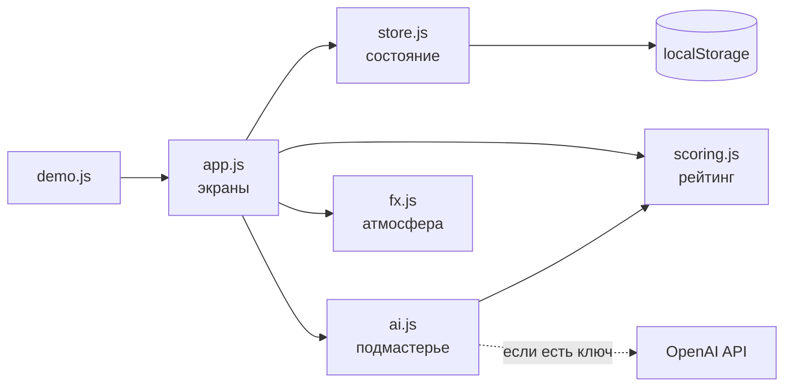

# TASK FORGE

> **Бизнес не пишет задачи. Бизнес куёт их.**
> **Студенты не откликаются. Студенты берут контракт.**
> **Слабая задача — холодный слиток. Сильная — раскалённый клинок.**

MVP хакатона AI Sana по кейсу «Рейтинг качества бизнес-задач и открытый выбор команд».
Репозиторий: https://github.com/BAITC-Hacks/hack-e3809f66-jasai

---

## 1. Что это

**Проблема.** Бизнес приносит студентам задачи вроде «Хотим понять, почему клиенты уходят». В таком описании нет данных, критериев успеха, сроков и контакта. Студенты тратят недели на выяснение деталей или берутся за задачу, которую невозможно довести до результата.

**Решение.** Бизнес описывает потребность своими словами. ИИ находит пробелы и задаёт уточняющие вопросы, из ответов собирается карточка задачи с **рейтингом готовности 0–100**. Чем полнее задача, тем выше её позиция в открытом каталоге. Студенческие команды **сами** выбирают задачи и отправляют контракты, а бизнес **сам**, вручную, принимает или отклоняет их.

**Метафора кузницы** — это логика продукта, а не только оформление:

| В продукте | В кузнице | Как видно в интерфейсе |
|---|---|---|
| Черновик с низким рейтингом | Холодный серый слиток со ржавчиной | Слиток на наковальне серый, ядро рейтинга тусклое, подпись «Слиток не закалён» |
| Ответ на вопрос ИИ | Удар молота | Молот бьёт, искры летят из поля ответа в ядро рейтинга, число растёт |
| Рост рейтинга | Нагрев металла | Цвет слитка: пепел → ржавчина → жар → янтарь → добела; шкала температуры в градусах |
| Задача уровня «Приоритетная» (90+) | Готовый клинок | Лаймовое свечение, пульсация, «Оружие готово» |
| Публикация | Готовое изделие уходит из кузницы | Экран раскалывается трещиной, вспышка, задача улетает метеоритом в каталог |
| Отклик команды | Контракт с подписью | Форма с подписью от руки на canvas, отправленный контракт сворачивается в свиток и улетает |
| Решение бизнеса | Печать на свитке | Свиток разворачивается, печать «ОТОБРЕНО» или «ОТКАЗАНО» с отскоком |

## 2. Быстрый старт

Нужен только браузер: Chrome или Edge (рекомендуется), Firefox. Установка пакетов и сборка не требуются.

```bash
git clone https://github.com/BAITC-Hacks/hack-e3809f66-jasai.git
cd hack-e3809f66-jasai
start index.html        # Windows  (macOS: open index.html, Linux: xdg-open index.html)
```

Или через локальный сервер: `python -m http.server 8000` → http://localhost:8000.

1. На главной нажмите **«▶ Смотреть демо»**: весь сценарий ТЗ пройдёт сам через настоящий интерфейс (~1,5 минуты).
2. **Тесты:** откройте `tests.html`. Ожидаемый результат: `PASSED: 26 из 26`.
3. **Звук:** кнопка «♪ звук выкл» в шапке (по умолчанию выключен, браузеры запрещают автозвук).
4. **OpenAI (необязательно):** раздел **ИИ** → режим «OpenAI API» → вставить `OPENAI_API_KEY` → «Сохранить». Без ключа всё работает на эвристике.
5. **Сброс данных:** раздел **ИИ** → «Сбросить демо-данные» (нажать дважды).

## 3. Архитектура

Одностраничное приложение на чистом JavaScript, без сборки. Модули подключаются через `<script>` и общаются через глобальные объекты. Данные хранятся в `localStorage`.

```
index.html          оболочка: mesh-фон, шум, загрузчик, canvas для искр
css/style.css       дизайн-система «Industrial Occult»: палитра, шрифты, анимации
js/seed.js          сид-данные 5+5+5+5, достижения, сценарий демо
js/scoring.js       формула рейтинга, уровни, температура слитка, сложность для Hunt Map (чистые функции)
js/ai.js            промпты, JSON-схемы, эвристика, вызов OpenAI, валидация, факт-чек, рекомендации
js/store.js         состояние и операции: подтвердить, опубликовать, контракт, печать, этап, достижения
js/fx.js            атмосфера: Web Audio, искры, курсор, загрузчик, ритуал публикации, «шёпот», View Transitions
js/app.js           экраны и роутер
js/demo.js          автоматический демо-прогон по кнопке «Смотреть демо»
data/prompts.md     AI-промпты, формат входа и выхода, обработка ошибок
tests.html, js/tests.js   26 автотестов
```



**Метафоры в коде.** `strike()` — удар молота (анимация, звук `hammer`, искры). `updateScene()` при росте рейтинга вызывает `FX.flyTo()`, и искры летят от поля ввода в ядро. `FX.ritual()` отвечает за трещину, вспышку и метеорит при публикации. `decide()` ставит печать на свиток. `heatColor()` превращает рейтинг в цвет металла.

| Экран | Роль | Что делает |
|---|---|---|
| Главная (bento) | все | Манифест, живой слиток, статистика, уровни, кнопка демо |
| Кузница `#/forge` | бизнес | Черновик → удары-вопросы → карточка → подтверждение → публикация. Справа сцена со слитком, молотом, ядром рейтинга, температурой и расшифровкой |
| Мои сплавы `#/business` | бизнес | Задачи компании, свитки, ожидающие печати, зал достижений |
| Каталог `#/catalog` | все | Список или Hunt Map, сортировка, фильтры |
| Задача `#/task/:id` | все | Карточка, история закалки. Для команды — форма контракта, для владельца — свитки и печати |
| Компас `#/compass` | команда | 3–5 рекомендаций, стрелка указывает на лучшую |
| Контракты `#/contracts` | команда | Свои свитки с печатями и баллами за этапы |
| Гильдии `#/teams` | все | Команды и баллы за подтверждённый прогресс |
| ИИ `#/ai` | все | Режим, ключ, промпты, журнал, проверка плохих ответов |

## 4. Формула рейтинга

Баллы засчитываются только за **подтверждённую** карточку. Во время редактирования рейтинг пересчитывается мгновенно как предварительный: «Подтверждено 62 → станет 87 (+25)».

| Показатель | Вес | Поля |
|---|---|---|
| Контекст и потребность | 20 | контекст 10 + потребность 10 |
| Данные и материалы | 20 | данные |
| Ожидаемый результат | 15 | ожидаемый результат |
| Критерии успеха | 15 | критерии успеха |
| Ограничения | 10 | ограничения |
| Пользователи | 10 | пользователи |
| Связь с бизнесом | 10 | контакт 5 + формат взаимодействия 5 |

```
для каждого поля:
  пусто                       → 0
  короче 20 символов           → 0.3 × вес   (кроме контакта)
  выполнен признак полноты     → 1.0 × вес
  иначе                        → 0.7 × вес
рейтинг = Σ round(вес × доля)                 (0–100)
```

Признаки полноты:
- **Контекст**: не менее 80 символов.
- **Потребность**: не менее 40 символов и глагол изменения («нужно», «сократить», «автоматизировать»).
- **Пользователи**: названа роль или количество.
- **Данные**: указан источник (CSV, Excel, API, выгрузка…) и цифра (объём, период) либо описание от 60 символов.
- **Ожидаемый результат**: не менее 50 символов и артефакт (прототип, бот, дашборд, модель…).
- **Критерии успеха**: есть число или процент.
- **Ограничения**: указаны срок, технология, доступ, NDA или бюджет.
- **Контакт**: email, телефон или t.me.
- **Формат взаимодействия**: указаны регулярность или канал.

**Примеры расчёта** (сценарий демо и сид-данные):

| Состояние | Рейтинг | Уровень |
|---|---|---|
| «Хотим понять, почему клиенты уходят.» — только потребность, частично (7) | **7** | Черновик |
| + ответ про данные (выгрузка за 2 года в CSV) | **27** | Черновик |
| + контекст, ожидаемый результат, пользователи | **62** | Рабочая |
| + ручная правка: критерии с цифрами (+15), контакт (+5), формат связи (+5) | **87** | Готовая |
| Сид-задача «Аналитика оттока учеников» (ограничения описаны слишком кратко: 3 из 10) | **93** | Приоритетная |
| Сид-задача «Оптимизация маршрутов курьеров» (все поля полные) | **100** | Приоритетная |

| Диапазон | Уровень | Подпись | Влияние |
|---|---|---|---|
| 0–39 | Черновик | «Слиток не закалён» | Виден в каталоге с пометкой, откликаться можно |
| 40–69 | Рабочая | «Ещё удар молота» | Задача участвует в рекомендациях |
| 70–89 | Готовая | «Почти клинок» | Повышенная позиция в каталоге |
| 90–100 | Приоритетная | «Оружие готово» (пульсирует) | Выделена свечением |

Для каждого незаполненного или слабого поля показывается подсказка «+N баллов, если …» (например, «Критерии успеха: +15, если добавите измеримый показатель»). Подсказки видны в панели «Что повысит рейтинг» и в рукописном «шёпоте» у курсора.

## 5. Правила каталога

1. В каталоге **все** опубликованные задачи, включая черновики. Низкий рейтинг задачу не скрывает и контракт не запрещает.
2. Сортировка по умолчанию — по рейтингу (при равенстве выше более свежая). Доступна сортировка по дате и по названию. Номер `#N` — всегда позиция по рейтингу.
3. Фильтры: отрасль (chips, один выбор) и уровень готовности (chips, несколько).
4. Два вида: **Список** (карточки-сплавы) и **Hunt Map**. На карте ось Y — рейтинг с зонами уровней, ось X — сложность 1–10 (оценивается по ключевым словам результата и ограничений), размер звезды — число контрактов.
5. После публикации задача сразу встаёт на свою позицию и подсвечивается вспышкой.
6. Рекомендации (компас) — только подсказка среди задач с рейтингом ≥ 40, каталог не ограничивается.
7. Число контрактов не ограничено. Решение принимает только владелец задачи кнопками «Принять · печать» / «Отклонить» / «Снять печать». Можно принять 0, 1 или несколько команд. Задача с принятым контрактом помечается «В работе».
8. Баллы команда получает, когда бизнес подтверждает этап по принятому контракту: прототип +20, промежуточный результат +30, финальная сдача +50.

## 6. AI-модуль

Полная документация: [`data/prompts.md`](data/prompts.md).

- **`analyze`** (analyzeCompleteness) разносит черновик по полям и задаёт 3–5 вопросов по самым весомым пробелам, каждый с подсказкой `hint`.
- **`buildCard`** собирает карточку из черновика, полей и ответов. Ответ на вопрос о поле X попадает в поле X.

| Режим | Как работает |
|---|---|
| Эвристика (по умолчанию) | Предложения черновика раскладываются по полям по ключевым словам, вопросы строятся по пробелам формулы рейтинга. Работает без сети и ключа |
| OpenAI | `POST /v1/chat/completions`, `response_format: json_schema` (strict), `temperature: 0`, модель `gpt-4o-mini` (меняется в настройках) |

**Обработка ответа модели:** сеть/HTTP → отказ или обрезка → `JSON.parse` → проверка схемы → **факт-чек** (новые числа или больше 50% новых слов → поле заменяется словами пользователя) → минимум 3 вопроса → подсказки. При любой ошибке используется эвристика, причина показывается в интерфейсе и пишется в журнал. Каждый вызов логируется в консоль с префиксом `[AI]`. Кнопки «Не JSON», «Нарушена схема», «Выдуманные факты» в разделе ИИ показывают реакцию валидатора.

**Этика.** ИИ не добавляет фактов, текст правит и подтверждает человек, ИИ не выбирает команду, персональные признаки не используются, рекомендации не ограничивают каталог.

## 7. Креативные механики

| # | Механика | Где | Смысл |
|---|---|---|---|
| 1 | **Mesh-фон** из трёх градиентов (lime / plasma / ember), дрейф 40 с + SVG `feTurbulence` | везде | Металлическая пыль кузницы |
| 2 | **Кастомный курсор**: кольцо 24 px с `mix-blend-mode: difference` и лаймовая точка; на ссылках кольцо 56 px, клик выбивает 6 искр | desktop, отключён на touch и при reduced motion | Рука кузнеца |
| 3 | **Scroll-Driven Forge**: прокрутка кузницы поднимает молот и раздувает жар сцены | кузница | Скролл — замах молота |
| 4 | **Искры** (canvas, гравитация, затухание 1,2 с) | удар, рост рейтинга, публикация, печать, достижение | Жар передаётся в задачу |
| 5 | **Ритуал публикации**: SVG-трещины от центра (800 мс), вспышка, слиток улетает метеоритом | публикация | Изделие покидает кузницу |
| 6 | **Звук Web Audio**: гул 45/60/90 Гц с LFO; эффекты `hammer`, `spark`, `rumble`, `paper`, `stamp` синтезируются на лету, без mp3 | кнопка в шапке | Звук кузницы |
| 7 | **Микровзаимодействия**: кнопки 1.02/0.98, карточки меняют радиусы углов, ядро бьётся при росте, орбиты вращаются быстрее на высоких уровнях | везде | Живой металл |
| 8 | **View Transitions**: ядро рейтинга и название перелетают из каталога в карточку задачи | Chrome/Edge | Задача остаётся тем же предметом |
| 9 | **Загрузчик «Forge Ignites»**: искра → три луча → вспышка, один раз за сессию | первый заход | Горн разжигается |
| 10 | **Шёпот ИИ**: через 3 с бездействия у курсора появляется рукописная подсказка («Критерии успеха: +15, если…») | кузница | Подмастерье подсказывает |
| 11 | **Слиток на наковальне**: цвет по температуре, ржавчина исчезает с ростом рейтинга | кузница, главная | Рейтинг = температура |
| 12 | **Подпись на canvas** сохраняется как SVG-path и показывается на свитке | контракт | Контракт скреплён подписью |
| 13 | **Свитки** раскручиваются, **печать** шлёпается с отскоком | задача (бизнес), контракты | Решение — ручная печать |
| 14 | **Hunt Map**: звёзды мерцают в зонах уровней | каталог | Охотник выбирает цель |
| 15 | **Компас**: стрелка раскручивается и замирает на лучшей задаче | компас | Рекомендация, не приказ |
| 16 | **Достижения**: «Первый удар», «Мастер деталей», «Идеальный сплав», «Щедрый мастер», «Первый контракт» | медали с искрами, зал славы | Геймификация бизнеса |

Все анимации отключаются при `prefers-reduced-motion`.

## 8. Тестовые сценарии

Автотесты (`tests.html`, 26 проверок): веса 100, группы по шкале ТЗ, 0 и 100 баллов, **границы 39/40, 69/70, 89/90**, частичные баллы, рост после дополнения, сортировка, эвристика (≥3 вопросов, без выдуманных фактов), валидатор (не-JSON, схема, выдуманные цифры, корректный ответ), рекомендации только от 40, сид-данные 5+5+5+5, подписи уровней, температура, сложность, траектория демо.

Ручные сценарии:

| # | Действия | Ожидаемый результат |
|---|---|---|
| 1 | Кузница → «Первый удар» с пустым или коротким черновиком | Ошибка «от 20 символов», анализ не запускается |
| 2 | Черновик «Хотим понять, почему клиенты уходят.» → анализ | Рейтинг 7, уровень «Черновик», 5 вопросов, медаль «Первый удар» |
| 3 | Ответить на вопрос про данные | Молот бьёт, искры летят в ядро, рейтинг 7 → 27 |
| 4 | Собрать карточку → подтвердить → дописать критерии с цифрами | Панель «Подтверждено 62 → станет 77 (+15)», публикация заблокирована до повторного подтверждения |
| 5 | Команда: контракт без подписи и с короткой идеей | Ошибки валидации, контракт не отправлен |
| 6 | Бизнес: развернуть свиток → «Принять · печать» → «Подтвердить этап» | Печать «ОТОБРЕНО», задача «В работе», команда получает +20 в «Гильдиях» |
| 7 | ИИ → OpenAI с неверным ключом → анализ | Сообщение «ответ модели отклонён… → fallback», вопросы от эвристики |

## 9. Демо за 5 минут

| Время | Что показать |
|---|---|
| 0:00–0:20 | Главная: манифест, живой слиток. Загрузчик уже отыграл при входе |
| 0:20–1:50 | **«▶ Смотреть демо»** — автопрогон шагов 1–8 с подписями внизу экрана. Можно остановить и пройти вручную |
| 1:50–2:40 | Вручную: кузница, слабый черновик → ответы → искры и рост рейтинга → шёпот-подсказка → правка критериев → подтверждение |
| 2:40–3:10 | Публикация: трещина, метеорит, задача на своей позиции, медаль «Идеальный сплав» |
| 3:10–3:50 | Каталог: Список ↔ Hunt Map, фильтры, черновик виден. Роль команды: компас, контракт с подписью, свиток улетает |
| 3:50–4:30 | Роль бизнеса: свиток разворачивается, печать «ОТОБРЕНО», этап +20. Роль команды: «Контракты» |
| 4:30–5:00 | Раздел ИИ: промпты, журнал, кнопка «Выдуманные факты» — валидатор удаляет выдумку |

## 10. Ограничения MVP

- **Нет сервера**: данные хранятся в `localStorage` одного браузера (файла `/data/db.json` и API routes нет).
- **Нет регистрации и ролевой модели**: роль и компания или команда выбираются в шапке.
- Нет чата, уведомлений, календаря, файлового хранилища, полноценного трекера (вне рамок ТЗ, раздел 7).
- **Эвристика ИИ** работает по ключевым словам и не понимает смысл так, как модель. Формула полноты проверяет признаки (длина, цифры, ключевые слова), а не качество текста.
- **OpenAI вызывается из браузера**: ключ хранится в `localStorage`. Для продакшена нужен серверный прокси. С живым ключом режим не проверялся; проверены ошибки, валидация и fallback.
- **Сложность на Hunt Map** — эвристическая оценка, а не экспертная.
- Desktop-first: на мобильных всё открывается, но эффекты рассчитаны на мышь.
- Шрифты подключаются с Google Fonts; без интернета используются системные запасные.

## 11. Технологии и почему

| Технология | Зачем |
|---|---|
| **Чистый JavaScript (ES2020), HTML, CSS** | Проект открывается двойным кликом: жюри не нужны Node.js и `npm install`, ничего не сломается на защите |
| **CSS custom properties + `color-mix()`** | Один параметр `--heat` окрашивает слиток, ядро, свечение сцены и карточки — температура задачи проходит через весь интерфейс |
| **Canvas 2D** | Искры с гравитацией и полётом к цели, подпись от руки |
| **SVG** | Слиток, молот, наковальня, трещины ритуала, подписи в свитках, шум `feTurbulence` |
| **Web Audio API** | Гул горна и звуки удара, искр, бумаги и печати синтезируются на лету — без аудиофайлов |
| **View Transitions API** | Ядро рейтинга перелетает из каталога в карточку; в других браузерах обычный переход |
| **OpenAI Chat Completions + structured outputs** | Анализ черновика и сборка карточки со строгой JSON-схемой; ответ дополнительно проверяется на клиенте |
| **localStorage** | Состояние между перезапусками без сервера |
| **Google Fonts**: Space Grotesk, Inter Tight, JetBrains Mono, Caveat, Unbounded | Заголовки, текст, цифры рейтинга, рукописные подписи, логотип |

**Deployed-версия:** пока нет. Проект статический, поэтому его можно опубликовать на GitHub Pages без изменений: Settings → Pages → Deploy from branch → `main` / root.

---

*Начните с холодного слитка. Закончите клинком. Бизнес не пишет задачи — бизнес куёт их.*
